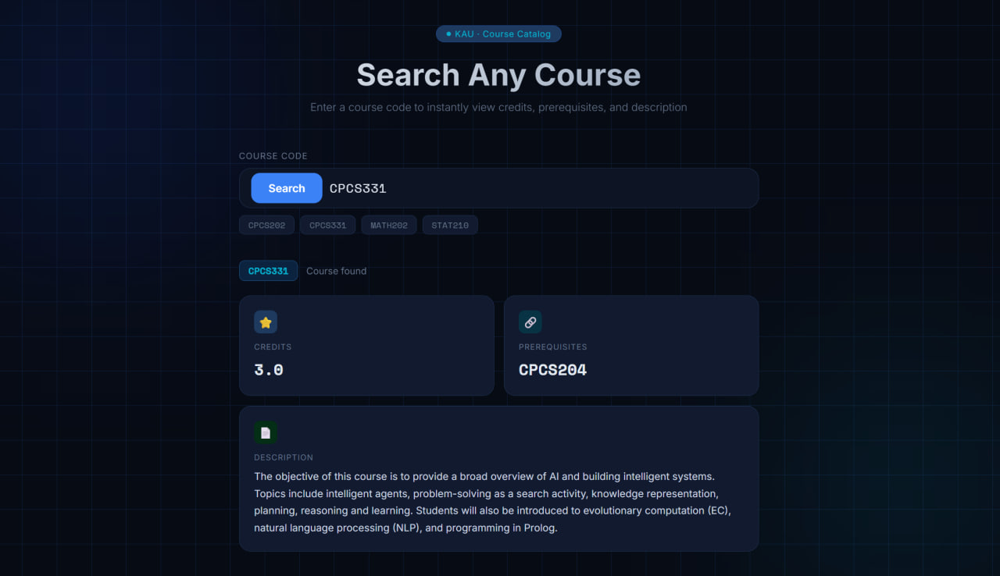

# 🎓 Ask Major — KAU Course Search System

A smart course search system that allows students to quickly explore university courses using course codes.

## 🚀 Features

* 🔍 Search courses by code (e.g. CPCS331)
* 📚 View:

  * Course credits
  * Prerequisites
  * Description
* ⚡ Fast retrieval using RAG (Retrieval-Augmented Generation)
* 💻 Clean and modern frontend UI

---

## 🧠 Tech Stack

* Python (Backend)
* JavaScript, HTML, CSS (Frontend)
* RAG-based search system
* CSV dataset (Course Catalog)

---

## 📂 Project Structure

```
backend/     → Python API & RAG logic  
frontend/    → UI (HTML, JS, CSS)  
```

---

## ▶️ How to Run

### 1. Clone the repo

```
git clone https://github.com/your-username/ask-major.git
cd ask-major
```

### 2. Run backend

```
cd backend
pip install -r requirements.txt
python backend.py
```

### 3. Run frontend

```
cd ../frontend
python -m http.server 5173
```

Then open:

```
http://localhost:5173
```

---

## 📸 Preview


---

## 👩‍💻 Author

Rana Alzahrani
